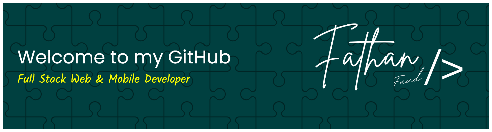

###

# Hi there, I'm Fathan! 👋

### 🚀 Full Stack Web & Mobile Developer

  <em>"Turning complex problems into simple, beautiful, and intuitive designs."</em>

☕ Powered by coffee

---

### 👨‍💻 About Me

- 💻 I’m a **Full Stack Developer** specializing in Web (Laravel) and Mobile (Android/Kotlin).
- 🎨 I enjoy turning complex problems into simple, beautiful, and intuitive designs.
- 🚀 I love exploring new technologies and leveraging them to build better products.
- 🏛️ Currently focused on mastering **System Architecture** and **Clean Architecture** patterns.

 

### 🚀 Current Status

* 🔭 **I’m currently working on:**
  * Scaling up my **School Management System** for better performance and architecture.
  * Expanding my portfolio with new **Full Stack projects**.

* 🌱 **I’m currently learning:**
  * Advanced Web Development with **Laravel**.
  * **Docker & Kubernetes** for modern deployment workflows.
  * Mobile Development ecosystem with **Kotlin** and **Flutter**.

---

### 🛠️ Tech Stack

  
  
  
  
  

  
  
  

  
  
  
  

 

### 🤝 Connect with Me

  
  
  
  

###

